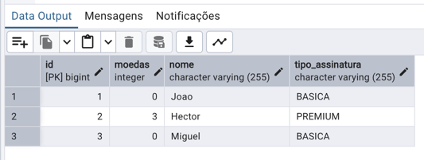
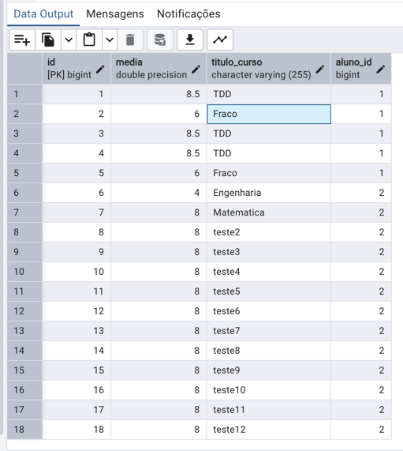

# Educação Continuada Gamificada — História 3QA

Spring Boot + TDD/ATDD (Red → Green → Blue) da US de progresso da assinatura básica rumo ao Premium.

**Stack:** API REST + **Vue 3 (CDN)** estático + **PostgreSQL** (sem H2, sem Thymeleaf).

---

## Estudo de caso

Educação Continuada Gamificada.

## User Story escolhida pelo grupo

| Campo | Conteúdo |
|--------|----------|
| Código | **3QA** |
| Integrante que redigiu | Miguel Muran |
| US | COMO usuário da assinatura básica, QUERO visualizar quantos cursos já concluí e quantos faltam para os 12 necessários, PARA ter clareza sobre minha evolução e o que falta para virar Premium |

## BDD por integrante

| Integrante | Cenário BDD |
|------------|-------------|
| João Gabriel | Exibir concluídos e faltantes para os 12 (BLUE) |
| Hector Silveira | Promover para Premium + 3 moedas ao atingir 12 (BLUE) |
| Miguel Muran | Não contabilizar curso com média &lt; 7,0 (BLUE) |

---

## Como funciona (regras de negócio)

1. Todo aluno nasce com assinatura **BASICA** e **0 moedas**.
2. Ao registrar um curso, só entra no progresso se a **média ≥ 7,0**.
3. O progresso mostra: **concluídos**, **faltantes** (meta = 12), **assinatura** e **moedas**.
4. Ao atingir **12 cursos válidos**, o aluno vira **PREMIUM** e recebe **3 moedas**.

Camada de domínio (TDD, JaCoCo 100%): `domain/`  
Persistência e API: `entity` → `repository` → `service` → `controller`  
Frontend: editar em `frontend/`; Maven copia para `static/` (servido em `/`)

---

## Como rodar

### Pré-requisitos

| Cenário | Necessário |
|---------|------------|
| **Opção A** (stack completa) | Docker Desktop |
| **Opção B** (app via Maven) | Docker Desktop + Java 17+ |
| **Testes / JaCoCo** | Java 17+ (Maven Wrapper incluso: `./mvnw`) |

### Opção A — Stack completa (recomendado)

Na raiz do projeto:

```bash
docker compose up --build
```

| Serviço | URL / acesso |
|---------|----------------|
| **Vue + API** | http://localhost:8080/ |
| **Swagger** | http://localhost:8080/swagger-ui.html |
| **Postgres** | host `localhost`, porta `5432`, db `progresso_db`, user/senha `progresso` |
| **pgAdmin** | http://localhost:5050/ · e-mail `admin@progresso.com` · senha `admin` |

### Opção B — Só Postgres no Docker + app no Maven

```bash
docker compose up -d postgres
./mvnw spring-boot:run
```

- Vue: http://localhost:8080/
- Swagger: http://localhost:8080/swagger-ui.html

### Testes e cobertura (domain 100%)

```bash
./mvnw test
./mvnw verify
```

Relatório JaCoCo: `target/site/jacoco/index.html`

### Parar os containers

```bash
docker compose down
```

Detalhes extras: [`docker/README.md`](docker/README.md).

---

## Como usar a interface (Vue)

1. Acessar http://localhost:8080/
2. Criar um aluno (nome).
3. Registrar conclusões de curso (título + média).
4. Acompanhar o card de progresso: concluídos / faltantes / assinatura / moedas.
5. Com **12 médias ≥ 7** no mesmo aluno → **PREMIUM** + **3 moedas** + **12 / 0**.

---

## Fluxo de teste da API (Swagger ou curl)

1. `POST /api/alunos` — `{ "nome": "Joao" }`
2. `POST /api/alunos/{id}/conclusoes` — `{ "tituloCurso": "TDD", "media": 8.5 }` → conta no progresso
3. Mesmo endpoint com `"media": 6.0` → **não** aumenta `cursosConcluidos`
4. `GET /api/alunos/{id}/progresso` — concluídos, faltantes, assinatura, moedas
5. Com 12 médias ≥ 7 → `PREMIUM` + 3 moedas

Endpoints principais:

| Método | Rota | Função |
|--------|------|--------|
| POST | `/api/alunos` | Cria aluno (BASICA) |
| GET | `/api/alunos` | Lista alunos |
| GET | `/api/alunos/{id}` | Busca por id |
| POST | `/api/alunos/{id}/conclusoes` | Registra curso e recalcula promoção |
| GET | `/api/alunos/{id}/progresso` | Consulta progresso |

---

## Como ver o banco no pgAdmin

1. Subir a stack (`docker compose up --build`).
2. Acessar http://localhost:5050/ com `admin@progresso.com` / `admin`.
3. **Adicionar Novo Servidor**:
   - **General → Name:** `progresso`
   - **Connection:**
     - Host: `postgres` *(nome do serviço na rede Docker; alternativa: `localhost`)*
     - Port: `5432`
     - Database: `progresso_db`
     - Username: `progresso`
     - Password: `progresso`
4. Navegar em: `Databases` → `progresso_db` → `Schemas` → `public` → `Tables`
5. Tabelas: **`alunos`** e **`conclusoes_curso`**

---

## Estrutura do projeto

```
src/main/java/org/example/bdd_teste/
├── BddTesteApplication.java
├── domain/           # regras TDD (100% JaCoCo)
├── entity/ dto/ repository/ service/ controller/
├── config/           # OpenAPI + CORS
└── exception/        # 404/400 limpos

frontend/                    # Vue (fonte da verdade)
src/main/resources/static/   # espelho gerado pelo Maven a partir de frontend/
docs/evidencias/             # RED / GREEN / BLUE / us-bdd / banco
docker-compose.yml + Dockerfile
```

Editar a SPA em `frontend/`. O Maven sincroniza para `static/` em todo build (`generate-resources`).

---

## Evidências

### User Stories e BDD

Arquivo: `docs/evidencias/us-bdd/USER STORIES_BDD.png`


Arquivo: `docs/evidencias/us-bdd/USER STORIES_BDD2.png`


### Banco (PostgreSQL via pgAdmin)

Arquivo: `docs/evidencias/banco/Tabela_banco_alunos.png`



Arquivo: `docs/evidencias/banco/Tabela_banco_conclusoes_curso.png`



### TDD — RED / GREEN / BLUE (JaCoCo)

| Fase | Pasta |
|------|--------|
| RED | [`docs/evidencias/red/`](docs/evidencias/red/) |
| GREEN | [`docs/evidencias/green/`](docs/evidencias/green/) |
| BLUE | [`docs/evidencias/blue/`](docs/evidencias/blue/) |

---

## Checklist da entrega

- [x] Pacote `domain` + classes de domínio
- [x] Pacote `domaintest` + 3 BDDs ativos (João / Hector / Miguel)
- [x] JaCoCo 100% no `domain`
- [x] Evidências RED / GREEN / BLUE / US-BDD
- [x] Entity, DTO, Repository, Service, Controller
- [x] Swagger / OpenAPI
- [x] Frontend Vue.js (CDN) em `/`
- [x] PostgreSQL (sem H2)
- [x] Docker + compose (app + Postgres + pgAdmin)
- [x] Prints de banco em `docs/evidencias/banco/`
