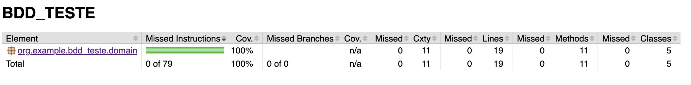
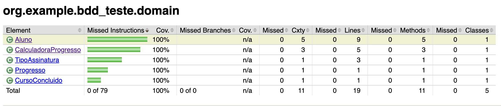

# Evidências TDD — BLUE

Fase BLUE da História 3QA (progresso da assinatura básica).  
Código de domínio refatorado; testes passando com cobertura **100%** (sem vermelho/amarelo no JaCoCo).

## Como foi executado

Executado pelo **Maven do IntelliJ IDEA Ultimate**.

- IDE: IntelliJ IDEA 2026.2.1
- Goals: `test` / `verify` (`pom.xml`) — `verify` gera o relatório JaCoCo
- Listener: plugin Maven do IntelliJ (`maven-event-listener.jar`)

## Resultado

```
[INFO] Running org.example.bdd_teste.domaintest.CalculadoraProgressoTest
[INFO] Tests run: 1, Failures: 0, Errors: 0, Skipped: 0

[INFO] Results:

[INFO] Tests run: 1, Failures: 0, Errors: 0, Skipped: 0

[INFO] BUILD SUCCESS
```

```
/bin/sh ./mvnw -Didea.version=2026.2.1 -Dmaven.ext.class.path=/Applications/IntelliJ IDEA.app/Contents/plugins/maven-plugin/lib/intellij.maven.rt/maven-event-listener.jar -Djansi.passthrough=true -Dstyle.color=always -Dmaven.repo.local=/Users/joaogabriellopesaguiar/.m2/repository test -f pom.xml
[INFO] Scanning for projects...
[INFO] 
[INFO] -----------------------< org.example:BDD_TESTE >------------------------
[INFO] Building BDD_TESTE 0.0.1-SNAPSHOT
[INFO]   from pom.xml
[INFO] --------------------------------[ jar ]---------------------------------
[INFO] 
[INFO] --- jacoco:0.8.15:prepare-agent (prepare-agent) @ BDD_TESTE ---
[INFO] argLine set to -javaagent:/Users/joaogabriellopesaguiar/.m2/repository/org/jacoco/org.jacoco.agent/0.8.15/org.jacoco.agent-0.8.15-runtime.jar=destfile=/Users/joaogabriellopesaguiar/Documents/DEVOPS/jogo-enigma-tdd-green-atdd-red-v5/TDD_TESTE/BDD_TESTE/target/jacoco.exec,excludes=org/example/bdd_teste/BddTesteApplication.class:**/package-info.class
[INFO] 
[INFO] --- resources:3.5.0:resources (default-resources) @ BDD_TESTE ---
[INFO] Copying 1 resource from src/main/resources to target/classes
[INFO] Copying 0 resource from src/main/resources to target/classes
[INFO] 
[INFO] --- compiler:3.15.0:compile (default-compile) @ BDD_TESTE ---
[INFO] Nothing to compile - all classes are up to date.
[INFO] 
[INFO] --- resources:3.5.0:testResources (default-testResources) @ BDD_TESTE ---
[INFO] skip non existing resourceDirectory /Users/joaogabriellopesaguiar/Documents/DEVOPS/jogo-enigma-tdd-green-atdd-red-v5/TDD_TESTE/BDD_TESTE/src/test/resources
[INFO] 
[INFO] --- compiler:3.15.0:testCompile (default-testCompile) @ BDD_TESTE ---
[INFO] Nothing to compile - all classes are up to date.
[INFO] 
[INFO] --- surefire:3.5.6:test (default-test) @ BDD_TESTE ---
[INFO] Using auto detected provider org.apache.maven.surefire.junitplatform.JUnitPlatformProvider
[INFO] 
[INFO] -------------------------------------------------------
[INFO]  T E S T S
[INFO] -------------------------------------------------------
[INFO] Running org.example.bdd_teste.domaintest.CalculadoraProgressoTest
[INFO] Tests run: 1, Failures: 0, Errors: 0, Skipped: 0, Time elapsed: 0.039 s -- in org.example.bdd_teste.domaintest.CalculadoraProgressoTest
[INFO] 
[INFO] Results:
[INFO] 
[INFO] Tests run: 1, Failures: 0, Errors: 0, Skipped: 0
[INFO] 
[INFO] ------------------------------------------------------------------------
[INFO] BUILD SUCCESS
[INFO] ------------------------------------------------------------------------
[INFO] Total time:  1.441 s
[INFO] Finished at: 2026-09-12T17:51:46-03:00
[INFO] ------------------------------------------------------------------------

```

## O que foi validado

| Item | Valor |
|------|--------|
| Classe | `CalculadoraProgressoTest` |
| Método | `deveExibirCursosConcluidosEFaltantesParaVirarPremium` |
| Fase | **BLUE** |
| Cenário | Aluno básico com 3 cursos válidos |
| Esperado | 3 concluídos e 9 faltantes para os 12 |
| Status | **PASSOU** |
| JaCoCo | **100%** (Application excluída do relatório; só Domain) |

## Cobertura JaCoCo
### página 1 — `target/site/jacoco/index.html`
 
No BLUE: cobertura **100%**, sem vermelho ou amarelo.



| Pacote | Cov. |
|--------|------|
| `org.example.bdd_teste.domain` | **100%** |
| **Total** | **100%** (0 of 79 missed) |

## Cobertura JaCoCo — pacote `domain` (elementos)
### página 2 — `org.example.bdd_teste.domain`

Print da página `org.example.bdd_teste.domain`.



| Elemento | Cov. |
|----------|------|
| `Aluno` | **100%** |
| `CalculadoraProgresso` | **100%** |
| `TipoAssinatura` | **100%** |
| `Progresso` | **100%** |
| `CursoConcluido` | **100%** |
| **Total do pacote** | **100%** |
