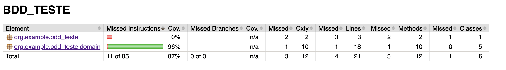
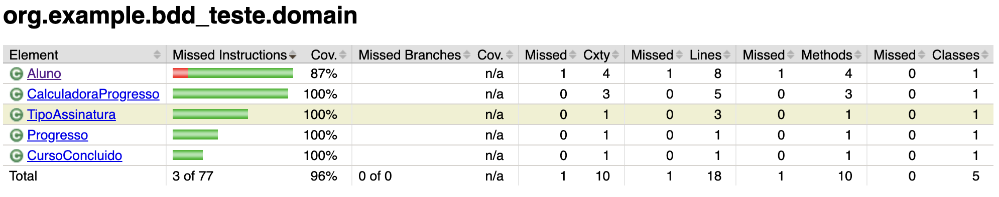

# Evidências TDD — GREEN

Fase GREEN da História 3QA (progresso da assinatura básica).  
Código mínimo para o teste passar.

## Como foi executado

Executado pelo **Maven do IntelliJ IDEA Ultimate** (goal `test`).

- IDE: IntelliJ IDEA 2026.2.1
- Goal: `test` (`pom.xml`)
- Listener: plugin Maven do IntelliJ (`maven-event-listener.jar`)

## Resultado

```
[INFO] Running org.example.bdd_teste.domaintest.CalculadoraProgressoTest
[INFO] Tests run: 1, Failures: 0, Errors: 0, Skipped: 0, Time elapsed: 0.048 s -- in org.example.bdd_teste.domaintest.CalculadoraProgressoTest

[INFO] Results:

[INFO] Tests run: 1, Failures: 0, Errors: 0, Skipped: 0

[INFO] BUILD SUCCESS
[INFO] Finished at: 2026-09-12T16:59:54-03:00
```

## O que foi validado

| Item | Valor |
|------|--------|
| Classe | `CalculadoraProgressoTest` |
| Método | `deveExibirCursosConcluidosEFaltantesParaVirarPremium` |
| Fase | **GREEN** |
| Cenário | Aluno básico com 3 cursos válidos |
| Esperado | 3 concluídos e 9 faltantes para os 12 |
| Status | **PASSOU** |

## Cobertura JaCoCo
### página 1 — `target/site/jacoco/index.html`

Gerado com Maven do IntelliJ (goal `verify`).  
No GREEN, amarelo/vermelho é permitido.



Observação: o vermelho do pacote raiz é o `BddTesteApplication` (boot Spring, fora do teste de domínio). No `domain`, falta cobrir `Aluno.getTipoAssinatura()` — ok na fase GREEN.

## Cobertura JaCoCo — pacote `domain` (elementos)
### página 2 — `target/site/jacoco/index.html`

Print da página `org.example.bdd_teste.domain`.


No GREEN, vermelho do `Aluno` é esperado e aceito.
