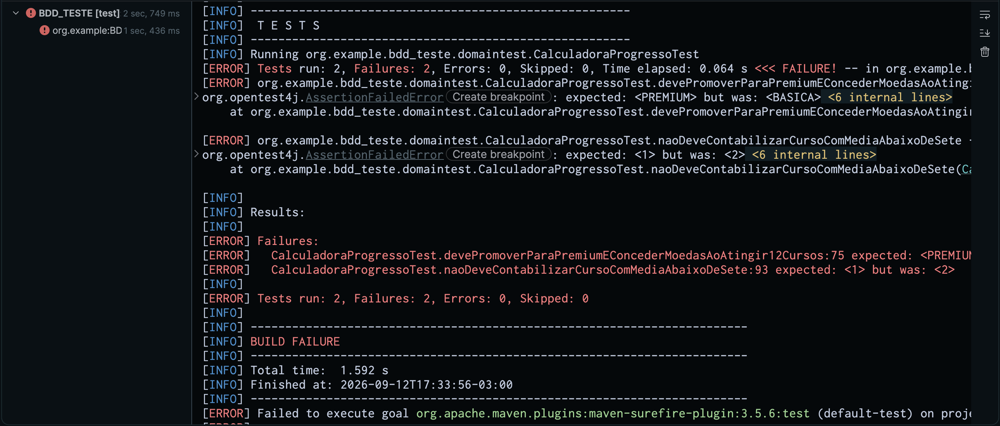
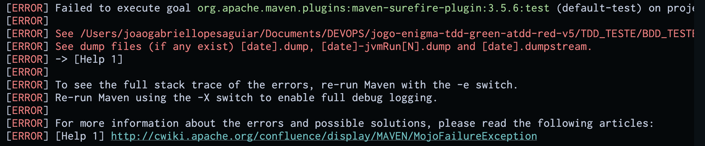
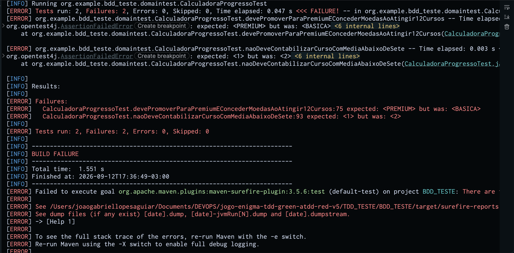

# Evidências TDD — RED

Fase RED da História 3QA (progresso da assinatura básica).  
Teste escrito primeiro; deve **falhar** (regra ainda não implementada).

## Como foi executado

Executado pelo **Maven do IntelliJ IDEA Ultimate**, **não pelo terminal**.

Rodados **dois goals**; ambos falharam como esperado no RED:

- IDE: IntelliJ IDEA 2026.2.1
- Goals: `install` e `test` (`pom.xml`)
- Listener: plugin Maven do IntelliJ (`maven-event-listener.jar`)

## Resultado — goal `install`

O `install` já executa os testes; com RED ativo o build **falha**.

```
[INFO] Running org.example.bdd_teste.domaintest.CalculadoraProgressoTest
[ERROR] Tests run: 2, Failures: 2, Errors: 0, Skipped: 0, Time elapsed: 0.043 s <<< FAILURE! -- in org.example.bdd_teste.domaintest.CalculadoraProgressoTest
[ERROR] org.example.bdd_teste.domaintest.CalculadoraProgressoTest.devePromoverParaPremiumEConcederMoedasAoAtingir12Cursos -- Time elapsed: 0.029 s <<< FAILURE!
org.opentest4j.AssertionFailedError: expected: <PREMIUM> but was: <BASICA>

[ERROR] org.example.bdd_teste.domaintest.CalculadoraProgressoTest.naoDeveContabilizarCursoComMediaAbaixoDeSete -- Time elapsed: 0.003 s <<< FAILURE!
org.opentest4j.AssertionFailedError: expected: <1> but was: <2>

[ERROR] Failures: 
[ERROR]   CalculadoraProgressoTest.devePromoverParaPremiumEConcederMoedasAoAtingir12Cursos:75 expected: <PREMIUM> but was: <BASICA>
[ERROR]   CalculadoraProgressoTest.naoDeveContabilizarCursoComMediaAbaixoDeSete:93 expected: <1> but was: <2>

[ERROR] Tests run: 2, Failures: 2, Errors: 0, Skipped: 0

[INFO] BUILD FAILURE
[ERROR] Failed to execute goal org.apache.maven.plugins:maven-surefire-plugin:3.5.6:test (default-test) on project BDD_TESTE: There are test failures.
```

## Resultado — goal `test`

Mesmas 2 falhas; diferença só de goal/tempo (sem etapa de install).

```
[INFO] Running org.example.bdd_teste.domaintest.CalculadoraProgressoTest
[ERROR] Tests run: 2, Failures: 2, Errors: 0, Skipped: 0, Time elapsed: 0.045 s <<< FAILURE! -- in org.example.bdd_teste.domaintest.CalculadoraProgressoTest
[ERROR] org.example.bdd_teste.domaintest.CalculadoraProgressoTest.devePromoverParaPremiumEConcederMoedasAoAtingir12Cursos -- Time elapsed: 0.030 s <<< FAILURE!
org.opentest4j.AssertionFailedError: expected: <PREMIUM> but was: <BASICA>

[ERROR] org.example.bdd_teste.domaintest.CalculadoraProgressoTest.naoDeveContabilizarCursoComMediaAbaixoDeSete -- Time elapsed: 0.003 s <<< FAILURE!
org.opentest4j.AssertionFailedError: expected: <1> but was: <2>

[ERROR] Failures: 
[ERROR]   CalculadoraProgressoTest.devePromoverParaPremiumEConcederMoedasAoAtingir12Cursos:75 expected: <PREMIUM> but was: <BASICA>
[ERROR]   CalculadoraProgressoTest.naoDeveContabilizarCursoComMediaAbaixoDeSete:93 expected: <1> but was: <2>

[ERROR] Tests run: 2, Failures: 2, Errors: 0, Skipped: 0

[INFO] BUILD FAILURE
[ERROR] Failed to execute goal org.apache.maven.plugins:maven-surefire-plugin:3.5.6:test (default-test) on project BDD_TESTE: There are test failures.
```

## O que foi validado

| Item | Valor |
|------|--------|
| Classe | `CalculadoraProgressoTest` |
| Fase | **RED** |
| Status | **FALHOU** (2 Failures) — evidência correta da fase |

| Método | Esperado | Obtido |
|--------|----------|--------|
| `devePromoverParaPremiumEConcederMoedasAoAtingir12Cursos` | `PREMIUM` | `BASICA` |
| `naoDeveContabilizarCursoComMediaAbaixoDeSete` | `1` concluído | `2` |

## Print do teste falhando
### Maven / Surefire

**Test:**





**Install:**


